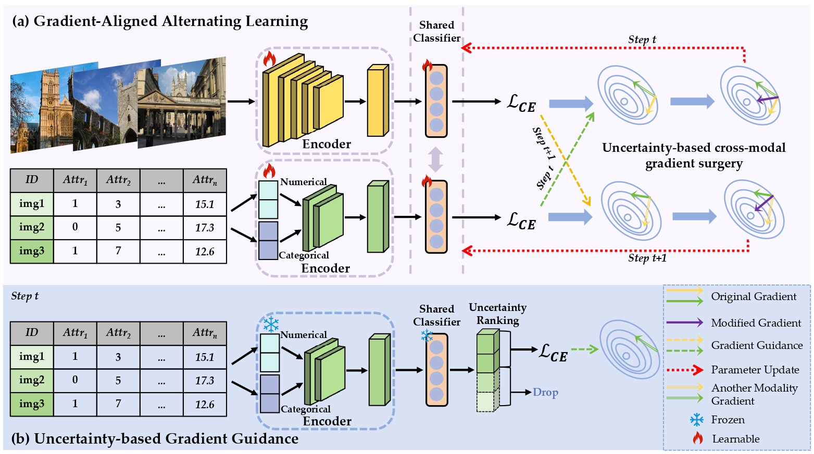

# Harmonized Tabular-Image Fusion via Gradient-Aligned Alternating Learning
This is the official code for the paper "Harmonized Tabular-Image Fusion via Gradient-Aligned Alternating Learning".

## Introduction
Multimodal tabular-image fusion is an emerging task that has received increasing attention in various domains. However, existing methods may be hindered by gradient conflicts between modalities, misleading the optimization of the unimodal learner. In this paper, we propose a novel Gradient-Aligned Alternating Learning (GAAL) paradigm to address this issue by aligning modality gradients. Specifically, GAAL adopts an alternating unimodal learning and shared classifier to decouple the multimodal gradient and facilitate interaction. Furthermore, we design uncertainty-based cross-modal gradient surgery to selectively align cross-modal gradients, thereby steering the shared parameters to benefit all modalities. As a result, GAAL can provide effective unimodal assistance and help boost the overall fusion performance. Empirical experiments on widely used datasets reveal the superiority of our method through comparison with various state-of-the-art (SoTA) tabular-image fusion baselines and test-time tabular missing baselines.

<p align="center">

</p>

## Installation

**Requirements**

* python 3.8
* pytorch 1.13.1
* torchaudio 0.13.1
* torchvision 0.14.1 
* torch-lightning 1.6.4
* pl-bolts 0.5.0
* opencv 4.9.0.80
* numpy 1.24.1

## Dataset

Download Dataset: 

The DVM cars dataset is open-access and can be found [here](https://deepvisualmarketing.github.io/).

The CelebA dataset is open-access and can be found [here](https://mmlab.ie.cuhk.edu.hk/projects/CelebA.html).

The SUN dataset is open-access and can be found [here](https://groups.csail.mit.edu/vision/SUN/hierarchy.html).

## Training

For training, we provide hyper-parameter settings in `/configs/configs.yaml`.

Your data should be constructed in `/configs/dataset`.

### Running

```bash
$ CUDA_VISIBLE_DEVICES=0 python run.py pretrain=False test=False evaluate=True test_and_eval=True datatype=imaging_and_tabular dataset={YOUR_DATASET}
```

## Acknowledgment

We thank the following repos providing helpful components/functions in our work.

- [MMCL](https://github.com/paulhager/MMCL-Tabular-Imaging)
- [TIP](https://github.com/siyi-wind/TIP)
- [CHARMS](https://github.com/RyanJJP/CHARMS)
